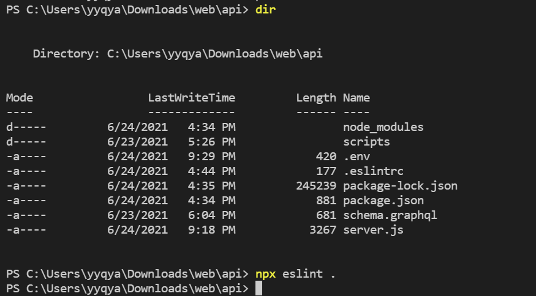
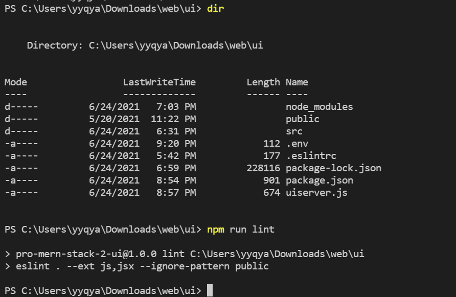
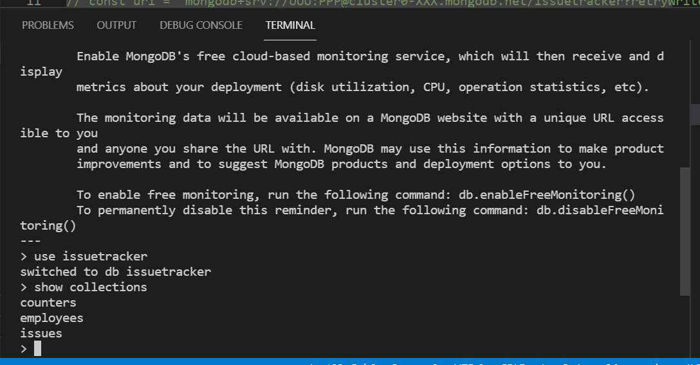
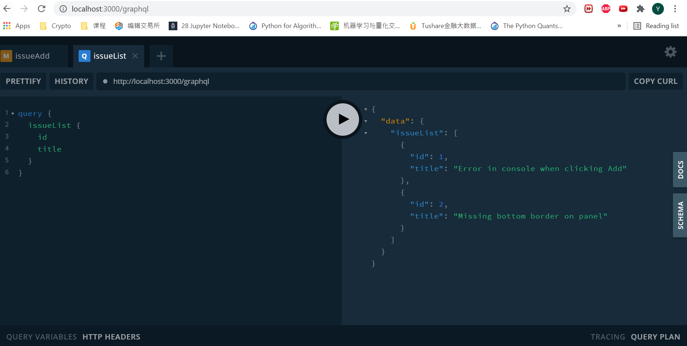
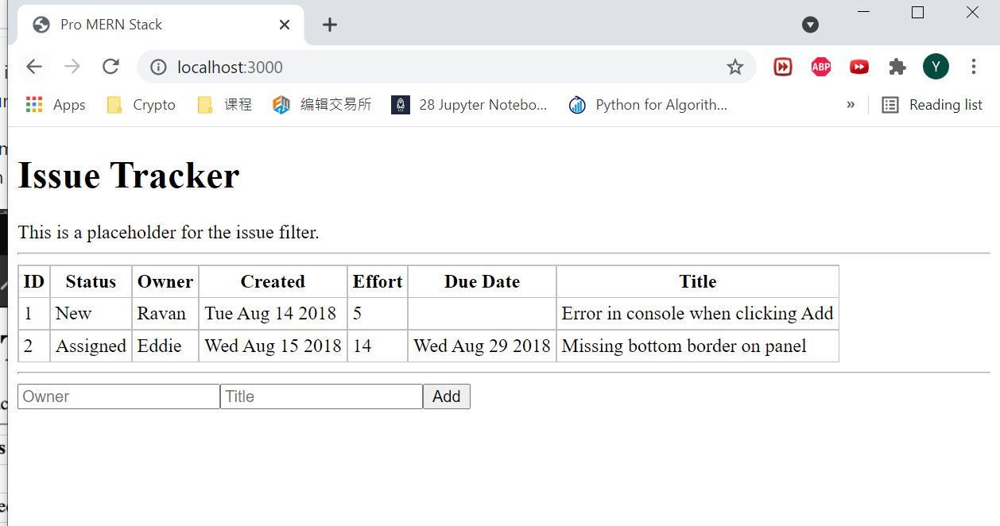

# Chapter Notes

## Chapter 7: highlight

This chapter focused on the architectural change by separating the UI and the API servers. Other key points included:

* Implications of CORS and coded an option for dealing with it using a proxy
* Use ESlint to check the code for both front end side and backend side

The issue encounter during this chapter was the npm cache. I was not able to install modules until I have cleaned the npm cache forcefully. 

The screenshot of the final work is showing below:

## Chapter 6: highlight

This chapter focused on the installation and other ways of getting access to an instance of a database in MongoDB.

* Use the mongo shell and the Node.js driver to access the basic operations in MongoDB.
* The CRUD operations
* Modified the issue tracker to use above methods to read and write to the MongoDB database.

The issue encounter during this chapter is the environment path. I was not able to use mongo function on cmd until I add environment path of the db bin folder. 

The screenshot of the final work is showing below:

## Chapter 5: highlight

This chapter focused on GraphQL API standard

* Built C and R part of CRUD
* Validation implementation and use GraphQL to handle errors
* Moved the array of issues from the browser's memory to the server's memory.

The issue encounter during this chapter is the complie process of UI and GraphQL. I was not able to display the issue list in the UI but was able to see it at GraphQL server. The root cause was the npm run compile function. I didnt initiate npm run watch and forgot to run compile. 
The screenshot of the final work is showing below:

## Chapter 4: highlight

This chapter focused on how to use state and make change to it on user interactions or other events.

* Got a sense of basic user interaction：the click of a button to add a new issues
* Understood the difference between props and state.
* Understood how the UI causes the state to change and how the props in the descendant components changed
* Understood how a child can communicate with its parent via callbacks.

There was no major issues encounter during the development and the screenshot of the final work is showing below:

## Chapter 3: highlight

In this chapter a barebones version of the main page of the Issue Tracker was created.

* Using React classes instead of simple elements
* Writing individueal components and putting them together (composing) in an enclosing component
* Passed parameters or data from an enclosing component to its children
* Reused a component class and rendered it differently with different data, dynamically using a map() to generate components based on an array of input data

There was no major issues encounter during the development and the screenshot of the final work is showing below:

## Chapter 2: highlight

This chapter includes the basics of React applications can be built

* A server-less Hello World page has been created and a brief tryout of jsx
* Project set up including the nvm, Node.js, npm and Express
* Separate Script files and JSX transform to move the transformation to the build stage in the development. 

  - Issue encounter at this part, the working directory was messed up and when I try to deploy the page at localhost, the 404 error was kept coming. Finally, the final solution was managing the project package in the same directory as the development files.

* Set up the older Browser Support functions and install npm automate packages for development usage

Screenshot of the final work:

