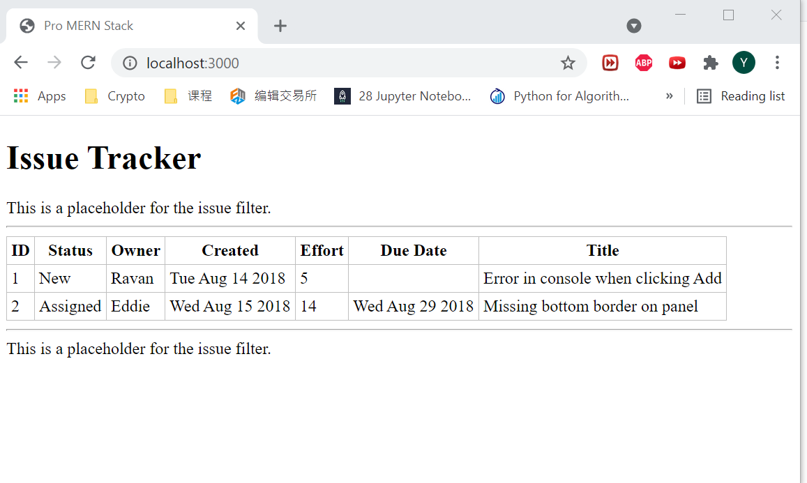
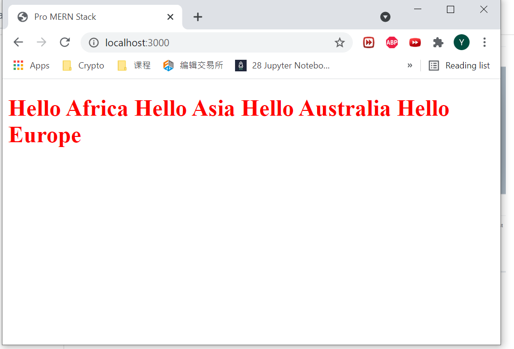

# Chapter Notes

## Chapter 3: highlight

In this chapter a barebones version of the main page of the Issue Tracker was created.

* Using React classes instead of simple elements
* Writing individueal components and putting them together (composing) in an enclosing component
* Passed parameters or data from an enclosing component to its children
* Reused a component class and rendered it differently with different data, dynamically using a map() to generate components based on an array of input data

There was no major issues encounter during the development and the screenshot of the final work is showing below:

## Chapter 2: highlight

This chapter includes the basics of React applications can be built

* A server-less Hello World page has been created and a brief tryout of jsx
* Project set up including the nvm, Node.js, npm and Express
* Separate Script files and JSX transform to move the transformation to the build stage in the development. 

  - Issue encounter at this part, the working directory was messed up and when I try to deploy the page at localhost, the 404 error was kept coming. Finally, the final solution was managing the project package in the same directory as the development files.

* Set up the older Browser Support functions and install npm automate packages for development usage

Screenshot of the final work:

