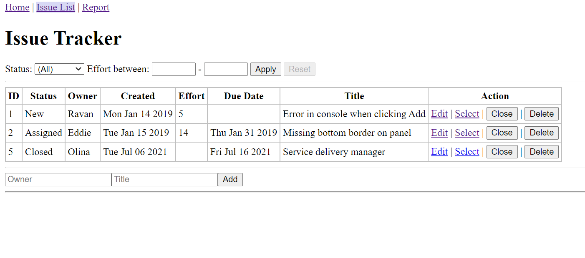

# Chapter Notes

## Chapter 15: highlight

In this chapter the application was deployed. Heroku was used as a Platform as a Service to deploy and mantain the application live. Repos for UI and API were created separately and those were deployed individually on heroku, so the API can be accessed on the playground using graphql. One of the most challeging parts on this chapter was to connect an online database to the application. At the end of the chapter Proxy mode was used to share the same resources between API and UI applications.

There were several issues during the app delpoyment. 
* How to connect DB to heroku. It was solved by finding the correction version of the connecting code. 
* How to connect DB to the mongo shell and initial the DB. It was sloved by adding password in the connection code.
* Changing to the Proxy mode. The cookie domain was wrong and there was a typo in the URL.
* Google authenticatation. The authenticatation button was disabled, I solved it by adding URL in the google cloud platform.

The Screenshots of the final work is showing below:

## Chapter 14: highlight

This chapter focused on using Google to authenticate a user. The application allows the user to view all the information without signing in, but to make any changes, they have to sign in. It ensures that the entire pages can be rendered at the UI server even though they are authenticated pages. The key learning are:

* How JWT can be used to persist session information in a stateless yet secure manner.
* How authorization works with GraphQL APIs and how it can be extended to perform different authorization checks based on the application's needs.
* How CORS and cookie handling restrictions on the browser come into play when the browser accesses the APIs directly.

The Screenshots of the final work is showing below:

## Chapter 13: highlight

This chapter focused on a variety of techniques and concepts to implement common features that make the application more usable. The key points are:

* Higher order components (HOCs) - a common React pattern for reusable code.
* Use MongoDB's aggregate framework to summarized or even expand the data fetched from collections.
* implemented common features such as using third-party components for undong a delete and adding paginations.
* use a search control for finding issues based on a text index in MongoDB

There major issues encountered during the development, it was the MongoDB. I was not able to display paginations and use search in the UI. It turns out that I will need installing Schema at CMD rather than in the mongo shell using this command: mongo issuetracker scripts/init.mongo.js. Since it started with mongo so I got a bit confused.

The Screenshots of the final work is showing below:

## Chapter 12: highlight

This chapter mainly used complex constructs and patterns to implement server rendering, which generate HTML on the server in addition to being able to render to the DOM. This enables isomorphic applications, which use same codebase on the server as well as the client to do either task: render to the DOM or create HTML. The need for this is when the application needs to be indexed by search engines. To have a properly indexed application, the server needs to respond with the same HTML that will result after the Ajax call in componentDidMount() methods and subsequent re-rendering of the page. To make this work:

* Server Rendering. The first time any page is opened in the application (typing URL or refreshing the browser), the entire page will be constructed and returned from the server.
* Browser Rendering. Once any page is loaded and the user navigates to another page, it will work as a SPA. Only the API will be made, and the DOM will be modified directly on the browser.

There was no major issues encounter during the development, all the update related to this chapter was very straightforward. 

The Screenshots of the final work is showing below:

## Chapter 11: highlight

This chapter mainly focused on adding styles and thems to an application. the UI style was improved using React-Bootstrap. The first step of this chapter is installation of React-Bootstrap, then Different bootstrap components were implemented such as Table, Inline forms, horizontal forms, panels and Toast. Also, the Create Issue functionality was implemented as a modal component that can be accessed from any page on the application.

There was no major issues encounter during the development, all the update related to this chapter was very straightforward. 

The Screenshots of the final work is showing below:

## Chapter 10: highlight

This chapter mainly focused on the functions on the UI and the connection between DB side. We used the edit page to explore forms and look at the difference between controlled and uncontrolled form components. We also added new APIs to cater to the needs of the new form and completed the CRUD paradigm by adding a Delete operations. Lastly, we created specialized input components that could deal with different data types that one expects in most applications.

There was no major issues encounter during the development, all the update related to this chapter was very straightforward. 

The Screenshots of the final work is showing below:

## Chapter 9: highlight

This chapter learnt how to implement client-side routing includes show different pages depending on links in a menu or a navigation bar. It also shows how to connect the URL in the browser with that is shown in the page, and how parameters and query strings can be used to tweak the page contents.

In order to affect routing, any page needs to be connected to something that the browser recognizes and indicates that “this is the page that the user is viewing”. There are two ways:

* Hash-based. Uses the anchor portion of the URL (everything following the #). Every # portion can be interpreted a location within the page and there is only one page in a SPA.
* Browser history. Uses a new HTML5 API that lets JavaScript handle the page transitions, at the same time preventing the browser from reloading the page when the URL changes. It is useful when we want to render a complete page from the server itself, especially to let search engine crawlers get the content of the pages and index them.

There was no major issues encounter during the development and the screenshot of the final work is showing below:

## Chapter 8: highlight

This chapter helped to further improve the architecture of the application by splitting code into multiple files and adding tools such as Webpack to split front end code into component-based files, inject code into the browser incrementally, and refresh the browser automatically on front-end code changes. Also, the dependency on the CDN for runtime libraries was removed helped by webpack.The visuallization didnt change much.

There was no major issues encounter during the development and the screenshot of the final work is showing below:

## Chapter 7: highlight

This chapter focused on the architectural change by separating the UI and the API servers. Other key points included:

* Implications of CORS and coded an option for dealing with it using a proxy
* Use ESlint to check the code for both front end side and backend side

The issue encounter during this chapter was the npm cache. I was not able to install modules until I have cleaned the npm cache forcefully. 

The screenshot of the final work is showing below:

## Chapter 6: highlight

This chapter focused on the installation and other ways of getting access to an instance of a database in MongoDB.

* Use the mongo shell and the Node.js driver to access the basic operations in MongoDB.
* The CRUD operations
* Modified the issue tracker to use above methods to read and write to the MongoDB database.

The issue encounter during this chapter is the environment path. I was not able to use mongo function on cmd until I add environment path of the db bin folder. 

The screenshot of the final work is showing below:

## Chapter 5: highlight

This chapter focused on GraphQL API standard

* Built C and R part of CRUD
* Validation implementation and use GraphQL to handle errors
* Moved the array of issues from the browser's memory to the server's memory.

The issue encounter during this chapter is the complie process of UI and GraphQL. I was not able to display the issue list in the UI but was able to see it at GraphQL server. The root cause was the npm run compile function. I didnt initiate npm run watch and forgot to run compile. 
The screenshot of the final work is showing below:

## Chapter 4: highlight

This chapter focused on how to use state and make change to it on user interactions or other events.

* Got a sense of basic user interaction：the click of a button to add a new issues
* Understood the difference between props and state.
* Understood how the UI causes the state to change and how the props in the descendant components changed
* Understood how a child can communicate with its parent via callbacks.

There was no major issues encounter during the development and the screenshot of the final work is showing below:

## Chapter 3: highlight

In this chapter a barebones version of the main page of the Issue Tracker was created.

* Using React classes instead of simple elements
* Writing individueal components and putting them together (composing) in an enclosing component
* Passed parameters or data from an enclosing component to its children
* Reused a component class and rendered it differently with different data, dynamically using a map() to generate components based on an array of input data

There was no major issues encounter during the development and the screenshot of the final work is showing below:

## Chapter 2: highlight

This chapter includes the basics of React applications can be built

* A server-less Hello World page has been created and a brief tryout of jsx
* Project set up including the nvm, Node.js, npm and Express
* Separate Script files and JSX transform to move the transformation to the build stage in the development. 

  - Issue encounter at this part, the working directory was messed up and when I try to deploy the page at localhost, the 404 error was kept coming. Finally, the final solution was managing the project package in the same directory as the development files.

* Set up the older Browser Support functions and install npm automate packages for development usage

Screenshot of the final work:

